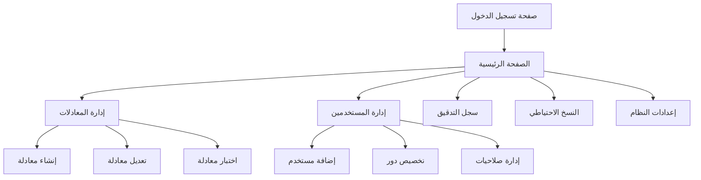

## 1. نظرة عامة على المنتج
لوحة تحكم شاملة لإدارة أنظمة الحضور والغياب مع محرك معادلات ديناميكي ونظام أدوار متقدم. توفر حلاً مرناً لحساب نقاط الحضور بدلاً من القيم الثابتة مع إمكانية التخصيص الكامل لكل عميل.
- تحل مشكلة الصيانة والتحديث المستمر للقواعد الحسابية في أنظمة الحضور التقليدية
- تستهدف المؤسسات التعليمية وشركات الموارد البشرية
- تساعد على تقليل الأخطاء الحسابية وزيادة كفاءة إدارة الحضور

## 2. الميزات الأساسية

### 2.1 أدوار المستخدمين
| الدور | طريقة التسجيل | الصلاحيات الأساسية |
|------|----------------|---------------------|
| مدير النظام | تسجيل مباشر من لوحة التحكم | وصول كامل لجميع الميزات |
| مسؤول المعادلات | تعيين من قبل المدير | إنشاء وتعديل المعادلات والقواعد |
| مراقب الحضور | تعيين من قبل المدير | عرض التقارير وتسجيل الحضور |
| مستعرض التقارير | تعيين من قبل المدير | عرض التقارير فقط |

### 2.2 وحدات الميزات
يتكون نظام لوحة التحكم من الصفحات الرئيسية التالية:
1. **الصفحة الرئيسية**: نظرة عامة على النظام، إحصائيات سريعة، الوصول السريع للوظائف
2. **إدارة المعادلات**: إنشاء المعادلات، تعديلها، حذفها، التحقق من صحتها
3. **إدارة المستخدمين**: إضافة مستخدمين، تخصيص الأدوار، إدارة الصلاحيات
4. **سجل التدقيق**: عرض سجل جميع العمليات، تصفية حسب المستخدم والتاريخ
5. **النسخ الاحتياطي**: إنشاء نسخ احتياطية، استعادة البيانات، جدولة النسخ
6. **إعدادات النظام**: تكوين عام للنظام، إعدادات الأمان، إعدادات API

### 2.3 تفاصيل الصفحات
| اسم الصفحة | اسم الوحدة | وصف الميزة |
|------------|------------|------------|
| الصفحة الرئيسية | لوحة المعلومات | عرض إحصائيات النظام الحية، عدد المستخدمين، حالة النظام |
| الصفحة الرئيسية | اختصارات سريعة | الوصول السريع للوظائف المستخدمة بكثرة |
| إدارة المعادلات | محرك المعادلات | إنشاء معادلات حسابية مع دعم المتغيرات والدوال الرياضية |
| إدارة المعادلات | التحقق من الصحة | التحقق التلقائي من صحة المعادلات قبل الحفظ |
| إدارة المعادلات | معاينة النتائج | عرض نتائج المعادلة على بيانات تجريبية |
| إدارة المستخدمين | إدارة الأدوار | إنشاء أدوار مخصصة مع صلاحيات محددة |
| إدارة المستخدمين | الصلاحيات المخصصة | تعيين صلاحيات على مستوى الحقول والإجراءات |
| سجل التدقيق | عرض السجل | عرض جميع العمليات مع التفاصيل الكاملة |
| سجل التدقيق | تصفية وتصدير | تصفية السجلات حسب المعايير المختلفة وتصديرها |
| النسخ الاحتياطي | إنشاء نسخة | إنشاء نسخة احتياطية كاملة للنظام |
| النسخ الاحتياطي | استعادة البيانات | استعادة البيانات من نسخة احتياطية مع التحقق |
| إعدادات النظام | إعدادات API | تكوين مفاتيح API وإدارة الوصول الخارجي |

## 3. العمليات الأساسية

### تدفق عمل المدير:
1. تسجيل الدخول إلى لوحة التحكم
2. إنشاء المعادلات الحسابية للحضور
3. تكوين الأدوار والصلاحيات للمستخدمين
4. مراجعة سجل التدقيق بشكل دوري
5. إعداد النسخ الاحتياطي التلقائي

### تدفق عمل مسؤول المعادلات:
1. تسجيل الدخول بالصلاحيات المخصصة
2. الوصول إلى قسم إدارة المعادلات
3. إنشاء أو تعديل المعادلات الحسابية
4. اختبار المعادلات على بيانات تجريبية
5. حفظ وتفعيل المعادلات الجديدة

## 4. تصميم واجهة المستخدم

### 4.1 أسلوب التصميم
- الألوان الأساسية: الأزرق الداكن (#1e40af) والأبيض
- الألوان الثانوية: الرمادي الفاتح (#f3f4f6) والأخضر للنجاح (#10b981)
- أزرار مستديرة الحواف مع تأثيرات تمرير خفيفة
- الخط: Arabic UI مع حجم 14px للنص الأساسي و16px للعناوين
- تصميم قائم على البطاقات مع فواصل واضحة
- أيقونات من مكتبة Heroicons مع ألوان متناسقة

### 4.2 نظرة عامة على تصميم الصفحات
| اسم الصفحة | اسم الوحدة | عناصر واجهة المستخدم |
|------------|------------|----------------------|
| الصفحة الرئيسية | لوحة المعلومات | بطاقات إحصائية ملونة، رسوم بيانية بسيطة، مؤشرات حالة |
| إدارة المعادلات | محرك المعادلات | محرر نصوص مع تمييز syntax، معاينة جانبية، أزرار اختبار |
| إدارة المستخدمين | جدول المستخدمين | جدول قابل للفرز والتصفية، أزرار إجراءات، نافذة منبثقة للتفاصيل |
| سجل التدقيق | عرض السجل | جدول زمني مع تصفية متقدمة، تصدير إلى Excel/PDF |
| النسخ الاحتياطي | لوحة التحكم | أزرار عمل كبيرة، شريط تقدم، رسائل حالة |

### 4.3 التجاوب
- التصميم الأساسي للكمبيوتر المكتبي مع إمكانية التكيف مع الأجهزة اللوحية
- عرض الشبكة المرنة (CSS Grid) للتكيف مع أحجام الشاشات المختلفة
- قائمة تنقل جانبية قابلة للطي على الأجهزة المحمولة