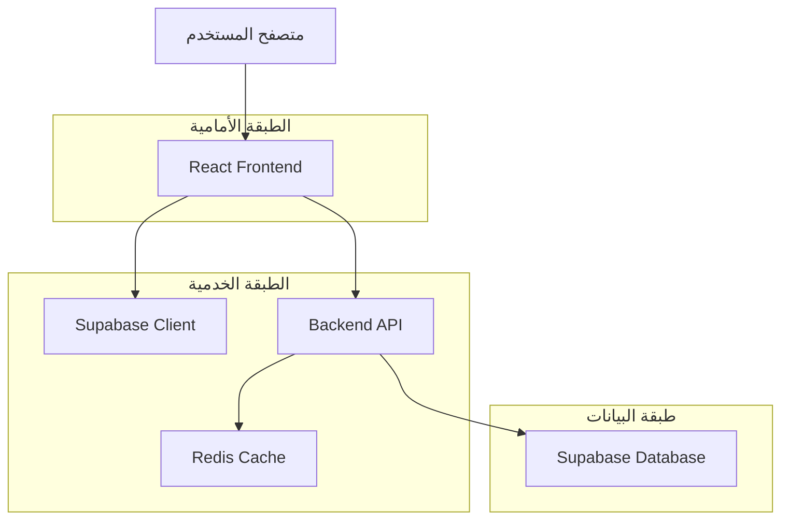
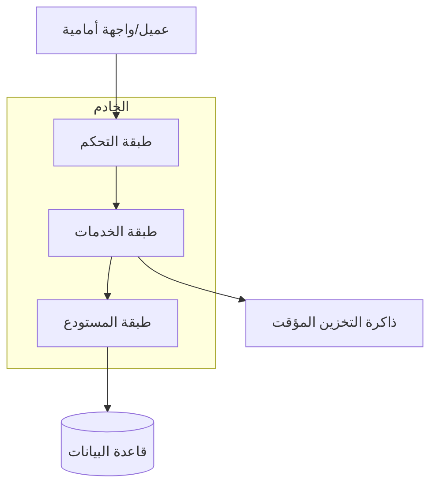
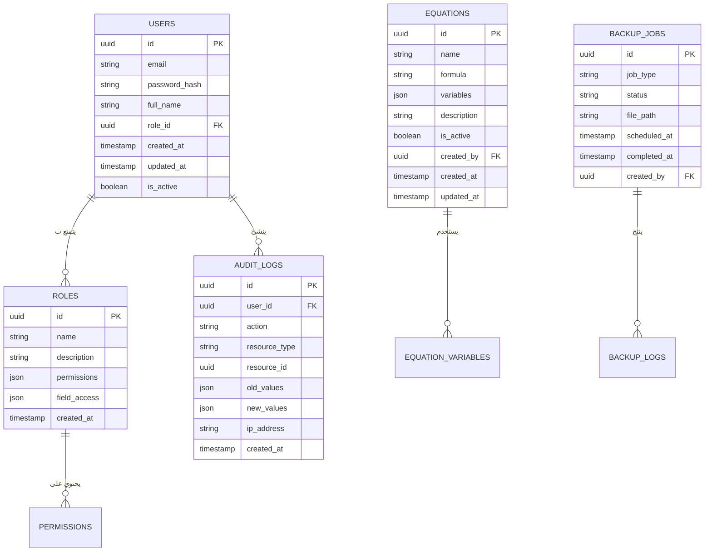

## 1. تصميم البنية التحتية



## 2. وصف التقنيات
- الواجهة الأمامية: React@18 + TypeScript + Tailwind CSS + Vite
- أداة التهيئة: vite-init
- الواجهة الخلفية: Node.js + Express@4 + TypeScript
- قاعدة البيانات: Supabase (PostgreSQL)
- التخزين المؤقت: Redis
- المصادقة: Supabase Auth
- التحقق من المعادلات: mathjs@11

## 3. تعريف المسارات
| المسار | الغرض |
|--------|--------|
| / | الصفحة الرئيسية ولوحة المعلومات |
| /login | صفحة تسجيل الدخول |
| /equations | إدارة المعادلات الحسابية |
| /users | إدارة المستخدمين والأدوار |
| /audit | سجل التدقيق والمراجعة |
| /backup | النسخ الاحتياطي واستعادة البيانات |
| /settings | إعدادات النظام العامة |
| /api/equations | واجهات API للمعادلات |
| /api/users | واجهات API لإدارة المستخدمين |
| /api/audit | واجهات API لسجل التدقيق |
| /api/backup | واجهات API للنسخ الاحتياطي |

## 4. تعريف واجهات API

### 4.1 معادلات الحضور
```
POST /api/equations/create
```

المعطيات:
| اسم المعامل | النوع | إلزامي | الوصف |
|-------------|--------|----------|------------|
| name | string | نعم | اسم المعادلة |
| formula | string | نعم | صيغة المعادلة الرياضية |
| variables | array | نعم | قائمة المتغيرات المستخدمة |
| description | string | لا | وصف المعادلة |

المخرجات:
| اسم المعامل | النوع | الوصف |
|-------------|--------|------------|
| equation_id | uuid | معرف المعادلة |
| status | string | حالة الإنشاء |
| validation_result | object | نتيجة التحقق من الصحة |

### 4.2 إدارة المستخدمين
```
POST /api/users/create-role
```

المعطيات:
| اسم المعامل | النوع | إلزامي | الوصف |
|-------------|--------|----------|------------|
| role_name | string | نعم | اسم الدور الجديد |
| permissions | object | نعم | صلاحيات الدور |
| field_level_access | object | لا | صلاحيات مستوى الحقول |

### 4.3 سجل التدقيق
```
GET /api/audit/logs
```

معاملات الاستعلام:
| اسم المعامل | النوع | الوصف |
|-------------|--------|------------|
| user_id | uuid | معرف المستخدم |
| start_date | date | تاريخ البداية |
| end_date | date | تاريخ النهاية |
| action_type | string | نوع الإجراء |

## 5. مخطط بنية الخادم


## 6. نموذج البيانات

### 6.1 تعريف نموذج البيانات


### 6.2 لغة تعريف البيانات

**جدول المستخدمين (users)**
```sql
-- إنشاء الجدول
CREATE TABLE users (
  id UUID PRIMARY KEY DEFAULT gen_random_uuid(),
  email VARCHAR(255) UNIQUE NOT NULL,
  password_hash VARCHAR(255) NOT NULL,
  full_name VARCHAR(100) NOT NULL,
  role_id UUID REFERENCES roles(id),
  is_active BOOLEAN DEFAULT true,
  created_at TIMESTAMP WITH TIME ZONE DEFAULT NOW(),
  updated_at TIMESTAMP WITH TIME ZONE DEFAULT NOW()
);

-- إنشاء الفهارس
CREATE INDEX idx_users_email ON users(email);
CREATE INDEX idx_users_role_id ON users(role_id);
```

**جدول المعادلات (equations)**
```sql
-- إنشاء الجدول
CREATE TABLE equations (
  id UUID PRIMARY KEY DEFAULT gen_random_uuid(),
  name VARCHAR(100) NOT NULL,
  formula TEXT NOT NULL,
  variables JSONB NOT NULL,
  description TEXT,
  is_active BOOLEAN DEFAULT true,
  created_by UUID REFERENCES users(id),
  created_at TIMESTAMP WITH TIME ZONE DEFAULT NOW(),
  updated_at TIMESTAMP WITH TIME ZONE DEFAULT NOW()
);

-- إنشاء الفهارس
CREATE INDEX idx_equations_name ON equations(name);
CREATE INDEX idx_equations_created_by ON equations(created_by);
CREATE INDEX idx_equations_is_active ON equations(is_active);
```

**جدول سجل التدقيق (audit_logs)**
```sql
-- إنشاء الجدول
CREATE TABLE audit_logs (
  id UUID PRIMARY KEY DEFAULT gen_random_uuid(),
  user_id UUID REFERENCES users(id),
  action VARCHAR(50) NOT NULL,
  resource_type VARCHAR(50) NOT NULL,
  resource_id UUID,
  old_values JSONB,
  new_values JSONB,
  ip_address INET,
  created_at TIMESTAMP WITH TIME ZONE DEFAULT NOW()
);

-- إنشاء الفهارس
CREATE INDEX idx_audit_logs_user_id ON audit_logs(user_id);
CREATE INDEX idx_audit_logs_action ON audit_logs(action);
CREATE INDEX idx_audit_logs_created_at ON audit_logs(created_at DESC);
CREATE INDEX idx_audit_logs_resource ON audit_logs(resource_type, resource_id);
```

**جدول النسخ الاحتياطي (backup_jobs)**
```sql
-- إنشاء الجدول
CREATE TABLE backup_jobs (
  id UUID PRIMARY KEY DEFAULT gen_random_uuid(),
  job_type VARCHAR(50) NOT NULL,
  status VARCHAR(20) NOT NULL,
  file_path VARCHAR(500),
  scheduled_at TIMESTAMP WITH TIME ZONE,
  completed_at TIMESTAMP WITH TIME ZONE,
  created_by UUID REFERENCES users(id),
  created_at TIMESTAMP WITH TIME ZONE DEFAULT NOW()
);

-- إنشاء الفهارس
CREATE INDEX idx_backup_jobs_status ON backup_jobs(status);
CREATE INDEX idx_backup_jobs_created_at ON backup_jobs(created_at DESC);
```

## 7. سياسات الأمان في Supabase

-- منح صلاحيات القراءة الأساسية للدور العام
GRANT SELECT ON equations TO anon;
GRANT SELECT ON users TO anon;

-- منح جميع الصلاحيات للمستخدمين المصدق عليهم
GRANT ALL PRIVILEGES ON equations TO authenticated;
GRANT ALL PRIVILEGES ON users TO authenticated;
GRANT ALL PRIVILEGES ON audit_logs TO authenticated;
GRANT ALL PRIVILEGES ON backup_jobs TO authenticated;

-- إنشاء سياسات الأمان
CREATE POLICY "السماح بقراءة المعادلات النشطة" ON equations
  FOR SELECT USING (is_active = true);

CREATE POLICY "السماح للمصدقين بإدارة المعادلات" ON equations
  FOR ALL USING (auth.role() = 'authenticated');

CREATE POLICY "سجل التدقيق للقراءة فقط" ON audit_logs
  FOR SELECT USING (true);